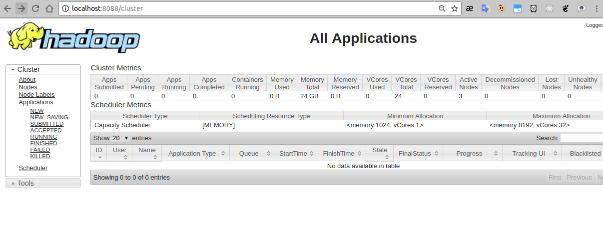
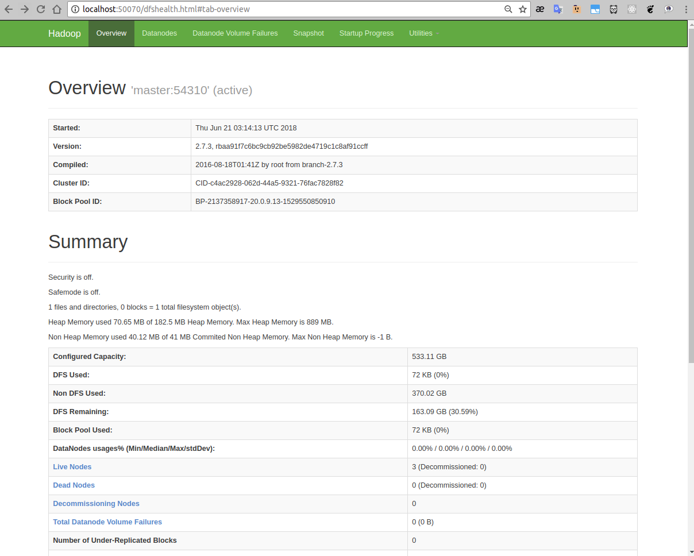

[](https://registry.hub.docker.com/u/luigymach/hadoop-spark-gpu-cluster/) [](https://registry.hub.docker.com/u/luigymach/hadoop-spark-gpu-cluster/)


`Setup`
=======

### Iniciar Swarm Nodes/Cluster

- Master
```console
master@master:~$ sudo docker swarm init

Swarm initialized: current node (dsaf6as5fdsa58) is now a manager.
To add a worker to this swarm, run the following command:

    docker swarm join --token <join-tokens> <Master-Node-IP>:2377

To add a manager to this swarm, run 'docker swarm join-token manager' and follow the instructions.

master@master:~$
```

- Slaves
	- `join-tokens` se muestra al ejecutar `swarm init` en el `Master`
```console
slaveN@slaveN:~$ sudo docker swarm join --token <join-tokens> <Master-Node-IP>:2377
```
> NOTA: para extraer `join-token` ejecutar `sudo docker swarm join-token manager`


### Crear una red
- Crear **hadoop-overlay-gpu**
```console
foo@bar:~$ sudo docker network create --driver overlay --attachable --subnet=20.0.9.0/24 hadoop-overlay-gpu

tyhsasgfcd456as5494bkwpdcinr
foo@bar:~$
```


### Ejecucion

- Master: Ejecutar script **start-server-only.sh**
```console
foo1@bar1:~$ ./start-server-only.sh

start MASTER container...

root@master:~#  ifconfig
eth0      Link encap:Ethernet  HWaddr 02:42:14:00:09:06  
          inet addr:20.0.9.5  Bcast:20.0.9.255  Mask:255.255.255.0
          UP BROADCAST RUNNING MULTICAST  MTU:1450  Metric:1
          RX packets:47 errors:0 dropped:0 overruns:0 frame:0
          TX packets:56 errors:0 dropped:0 overruns:0 carrier:0
          collisions:0 txqueuelen:0 
          RX bytes:10588 (10.5 KB)  TX bytes:10042 (10.0 KB)
          ...
          ..
          .
root@master:~#  
```
- Nodes: Ejecutar script **start-client-only.sh [slaveX]**
```console
foo2@bar2:~$ ./start-client-only.sh slave1
start slave1 container...
      slave1 is running

foo3@bar3:~$ ./start-client-only.sh slave2
start slave2 container...
      slave2 is running

foo4@bar4:~$ ...
foo5@bar5:~$ ..
foo6@bar6:~$ .
```


### Test Master and Nodes

- Master

```console
root@master:~# ssh master
The authenticity of host 'master (20.0.9.5)' can't be established.
ECDSA key fingerprint is SHA256:lwq6SpwZpZVXmPeSz7EhSFKyc7zIDKWCZpyEyasdfgh.
Are you sure you want to continue connecting (yes/no)? yes
...
..
.
root@master:~$ exit
Connection to master closed.

root@master:~$ ssh slave1
The authenticity of host 'slave1 (20.0.9.6)' can't be established.
ECDSA key fingerprint is SHA256:lwq6SpwZpZVXmPeSz7EhSFKyc7zIDKWCZpyEyqwerty.
Are you sure you want to continue connecting (yes/no)? 	**yes**
...
..
.
root@slave1:~$ exit
Connection to slave1 closed.

root@master:~$ ssh slave2
The authenticity of host 'slave2 (20.0.9.7)' can't be established.
ECDSA key fingerprint is SHA256:lwq6SpwZpZVXmPeSz7EhSFKyc7zIDKWCZpyEyzxcvbn.
Are you sure you want to continue connecting (yes/no)? 	**yes**
...
..
.
root@slave2:~$ exit
Connection to slave2 closed.

root@master:~$ ...
root@master:~$ ..
root@master:~$ .
```


### Master
- El tamanho definido del cluster es (1)master y (2)slave

```console
root@master:~# ./start-hadoop.sh
.
..
..
starting yarn daemons
starting resourcemanager, logging to /opt/hadoop-2.7.3/logs/yarn--resourcemanager-master.out
slave2: starting nodemanager, logging to /opt/hadoop-2.7.3/logs/yarn-root-nodemanager-slave2.out
master: starting nodemanager, logging to /opt/hadoop-2.7.3/logs/yarn-root-nodemanager-master.out
slave1: starting nodemanager, logging to /opt/hadoop-2.7.3/logs/yarn-root-nodemanager-slave1.out


root@master:~# ./start-spark.sh
.
..
...

starting org.apache.spark.deploy.master.Master, logging to /opt/spark-2.2.0-bin-hadoop2.7/logs/spark--org.apache.spark.deploy.master.Master-1-master.out
slave2: starting org.apache.spark.deploy.worker.Worker, logging to /opt/spark-2.2.0-bin-hadoop2.7/logs/spark-root-org.apache.spark.deploy.worker.Worker-1-slave2.out
slave1: starting org.apache.spark.deploy.worker.Worker, logging to /opt/spark-2.2.0-bin-hadoop2.7/logs/spark-root-org.apache.spark.deploy.worker.Worker-1-slave1.out

...
..
.
root@master:~#

```


### Check ports

En un navegador probar:
- [http://localhost:8080](http://localhost:8080)


- [http://localhost:8088](http://localhost:8088)



- [http://localhost:50070](http://localhost:50070)



### Test cluster


### Resize cluster
