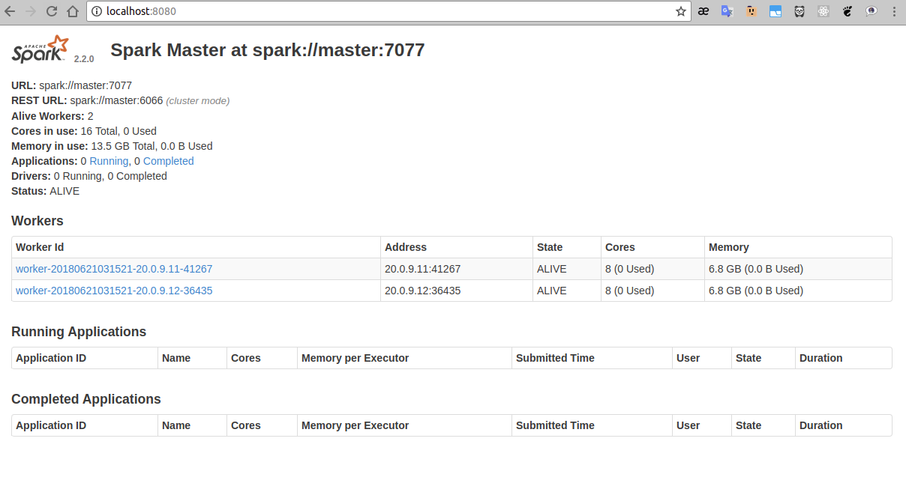

[](https://registry.hub.docker.com/u/luigymach/hadoop-spark-gpu-cluster/) [](https://registry.hub.docker.com/u/luigymach/hadoop-spark-gpu-cluster/)


`Setup`
=======

### Iniciar Swarm Nodes/Cluster

- Master
```console
master@master:~$ sudo docker swarm init

Swarm initialized: current node (dsaf6as5fdsa58) is now a manager.
To add a worker to this swarm, run the following command:

    docker swarm join --token <join-tokens> <Master-Node-IP>:2377

To add a manager to this swarm, run 'docker swarm join-token manager' and follow the instructions.

master@master:~$
```

- Slaves
	- `join-tokens` se muestra al ejecutar `swarm init` en el `Master`
```console
slaveN@slaveN:~$ sudo docker swarm join --token <join-tokens> <Master-Node-IP>:2377
```
> NOTA: para extraer `join-token` ejecutar `sudo docker swarm join-token manager`


### Crear una red
- Crear **hadoop-overlay-gpu**
```console
foo@bar:~$ sudo docker network create --driver overlay --attachable --subnet=20.0.9.0/24 hadoop-overlay-gpu

tyhsasgfcd456as5494bkwpdcinr
foo@bar:~$
```


### Ejecucion

- Master: Ejecutar script **start-server-only.sh**
```console
foo1@bar1:~$ ./start-server-only.sh

start MASTER container...

**root@master:~#**  ifconfig
eth0      Link encap:Ethernet  HWaddr 02:42:14:00:09:06  
          inet addr:20.0.9.5  Bcast:20.0.9.255  Mask:255.255.255.0
          UP BROADCAST RUNNING MULTICAST  MTU:1450  Metric:1
          RX packets:47 errors:0 dropped:0 overruns:0 frame:0
          TX packets:56 errors:0 dropped:0 overruns:0 carrier:0
          collisions:0 txqueuelen:0 
          RX bytes:10588 (10.5 KB)  TX bytes:10042 (10.0 KB)
          ...
          ..
          .
**root@master:~#**  
```
- Nodes: Ejecutar script **start-client-only.sh [slaveX]**
```console
foo2@bar2:~$ ./start-client-only.sh slave1
start slave1 container...
      slave1 is running

foo3@bar3:~$ ./start-client-only.sh slave2
start slave2 container...
      slave2 is running

foo4@bar4:~$ ...
foo5@bar5:~$ ..
foo6@bar6:~$ .
```


### Test SSH Master and Nodes

- Master

```console
root@master:~# ssh master
The authenticity of host 'master (20.0.9.5)' can't be established.
ECDSA key fingerprint is SHA256:lwq6SpwZpZVXmPeSz7EhSFKyc7zIDKWCZpyEyasdfgh.
Are you sure you want to continue connecting (yes/no)? yes
...
..
.
root@master:~$ exit
Connection to master closed.

root@master:~$ ssh slave1
The authenticity of host 'slave1 (20.0.9.6)' can't be established.
ECDSA key fingerprint is SHA256:lwq6SpwZpZVXmPeSz7EhSFKyc7zIDKWCZpyEyqwerty.
Are you sure you want to continue connecting (yes/no)? 	**yes**
...
..
.
root@slave1:~$ exit
Connection to slave1 closed.

root@master:~$ ssh slave2
The authenticity of host 'slave2 (20.0.9.7)' can't be established.
ECDSA key fingerprint is SHA256:lwq6SpwZpZVXmPeSz7EhSFKyc7zIDKWCZpyEyzxcvbn.
Are you sure you want to continue connecting (yes/no)? 	**yes**
...
..
.
root@slave2:~$ exit
Connection to slave2 closed.

root@master:~$ ...
root@master:~$ ..
root@master:~$ .
```


### Iniciar cluster
El tamanho definido del cluster es (1)master y (2)slave

- **Master**
```console
root@master:~# ./start-hadoop.sh
.
..
..
starting yarn daemons
starting resourcemanager, logging to /opt/hadoop-2.7.3/logs/yarn--resourcemanager-master.out
slave2: starting nodemanager, logging to /opt/hadoop-2.7.3/logs/yarn-root-nodemanager-slave2.out
master: starting nodemanager, logging to /opt/hadoop-2.7.3/logs/yarn-root-nodemanager-master.out
slave1: starting nodemanager, logging to /opt/hadoop-2.7.3/logs/yarn-root-nodemanager-slave1.out


root@master:~# ./start-spark.sh
.
..
...

starting org.apache.spark.deploy.master.Master, logging to /opt/spark-2.2.0-bin-hadoop2.7/logs/spark--org.apache.spark.deploy.master.Master-1-master.out
slave2: starting org.apache.spark.deploy.worker.Worker, logging to /opt/spark-2.2.0-bin-hadoop2.7/logs/spark-root-org.apache.spark.deploy.worker.Worker-1-slave2.out
slave1: starting org.apache.spark.deploy.worker.Worker, logging to /opt/spark-2.2.0-bin-hadoop2.7/logs/spark-root-org.apache.spark.deploy.worker.Worker-1-slave1.out

...
..
.
root@master:~#

```


### Check ports

En un navegador probar:
- [http://localhost:8080](http://localhost:8080)



- [http://localhost:8088](http://localhost:8088)


- [http://localhost:50070](http://localhost:50070)


### Test cluster
- 


- **Master**
```console
root@master:~# ./run-wordcount_hadoop.sh 
...
..
.
18/06/21 03:34:05 INFO client.RMProxy: Connecting to ResourceManager at master/20.0.9.13:8050
18/06/21 03:34:06 INFO input.FileInputFormat: Total input paths to process : 2
18/06/21 03:34:06 INFO mapreduce.JobSubmitter: number of splits:2
18/06/21 03:34:07 INFO mapreduce.JobSubmitter: Submitting tokens for job: job_1529550867614_0001
18/06/21 03:34:07 INFO impl.YarnClientImpl: Submitted application application_1529550867614_0001
18/06/21 03:34:07 INFO mapreduce.Job: The url to track the job: http://master:8088/proxy/application_1529550867614_0001/
18/06/21 03:34:07 INFO mapreduce.Job: Running job: job_1529550867614_0001
18/06/21 03:34:20 INFO mapreduce.Job: Job job_1529550867614_0001 running in uber mode : false
18/06/21 03:34:20 INFO mapreduce.Job:  map 0% reduce 0%
18/06/21 03:34:58 INFO mapreduce.Job:  map 100% reduce 0%
18/06/21 03:35:40 INFO mapreduce.Job:  map 100% reduce 100%
18/06/21 03:35:41 INFO mapreduce.Job: Job job_1529550867614_0001 completed successfully
18/06/21 03:35:41 INFO mapreduce.Job: Counters: 49
  ...
  ..
  .

input file1.txt:
18/06/21 03:35:42 WARN util.NativeCodeLoader: Unable to load native-hadoop library for your platform... using builtin-java classes where applicable
Hello Hadoop

input file2.txt:
18/06/21 03:35:44 WARN util.NativeCodeLoader: Unable to load native-hadoop library for your platform... using builtin-java classes where applicable
Hello Docker

wordcount output:
18/06/21 03:35:45 WARN util.NativeCodeLoader: Unable to load native-hadoop library for your platform... using builtin-java classes where applicable
Docker  1
Hadoop  1
Hello 2

root@master:~# 

```


### Resize cluster


> NOTA 1: Si usted ejecuto el cluster, debe detenerlo primero, ejecutar el script siguiente **stop-all.sh**

```console
root@master:~# ./stop-all.sh 

slave1: stopping org.apache.spark.deploy.worker.Worker
slave2: stopping org.apache.spark.deploy.worker.Worker
stopping org.apache.spark.deploy.master.Master
...
..
.
stopping yarn daemons
stopping resourcemanager
master: stopping nodemanager
slave1: stopping nodemanager
slave2: stopping nodemanager
no proxyserver to stop
 
root@master:~# 

```


> NOTA 2: Cluster por defecto tiene `(2)slaves`, para hacer un resize ejecutar lo siguiente **resize-cluster-gpu.sh N**, donde N es el nuevo de slaves requeridos.


- Ejemplo1: **Master** resize (3)slaves
```console
root@master:~# ./resize-cluster-gpu.sh 3
             
  > generate masters_file
  > generate slaves_file
             
** Ahora tienes:  3 slaves hadoop
master
slave1
slave2
slave3
** Ahora tienes:  3 slaves spark
slave1
slave2
slave3
  
root@master:~# 

```

- Ejemplo2: **Master** resize (4)slaves
```console
root@master:~# ./resize-cluster-gpu.sh 4
             
  > generate masters_file
  > generate slaves_file
             
** Ahora tienes:  4 slaves hadoop
master
slave1
slave2
slave3
slave4
** Ahora tienes:  4 slaves spark
slave1
slave2
slave3
slave4
  
root@master:~# 

```


##### Test Master and Nodes

- Para **ejemplo 1**: Continuando con [Test SSH Master and Nodes](#test-ssh-master-and-nodes) para (3)slaves.

```console
...
..
.
root@master:~$ ssh slave3
The authenticity of host 'slave3 (20.0.9.8)' can't be established.
ECDSA key fingerprint is SHA256:lwq6SpwZpZVXmPeSz7EhSFKyc7zIDKWCZpyEyzxcvbn.
Are you sure you want to continue connecting (yes/no)?  **yes**
...
..
.
root@slave3:~$ exit
Connection to slave3 closed.

root@master:~$ 
```


- Para **ejemplo 2**: Continuando con [Test SSH Master and Nodes](#test-ssh-master-and-nodes) para (4)slaves.

```console
...
..
.
root@master:~$ ssh slave3
The authenticity of host 'slave3 (20.0.9.8)' can't be established.
ECDSA key fingerprint is SHA256:lwq6SpwZpZVXmPeSz7EhSFKyc7zIDKWCZpyEyzxcvbn.
Are you sure you want to continue connecting (yes/no)?  **yes**
...
..
.
root@slave3:~$ exit
Connection to slave3 closed.

root@master:~$ ssh slave4
The authenticity of host 'slave4 (20.0.9.8)' can't be established.
ECDSA key fingerprint is SHA256:lwq6SpwZpZVXmPeSz7EhSFKyc7zIDKWCZpyEyzxcvbn.
Are you sure you want to continue connecting (yes/no)?  **yes**
...
..
.
root@slave4:~$ exit
Connection to slave4 closed.

root@master:~$ 
```


- Finalmente volver a ejecutar [Iniciar cluster](#iniciar-cluster).